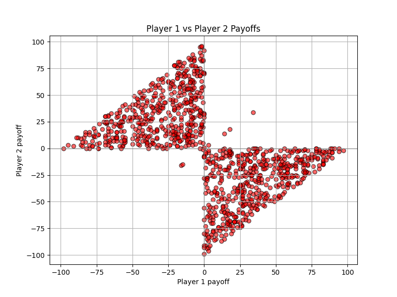
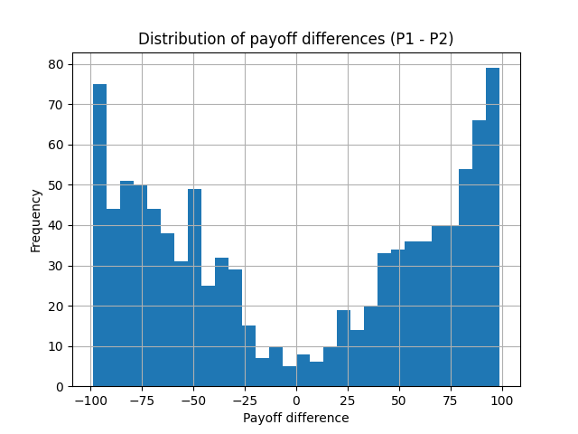
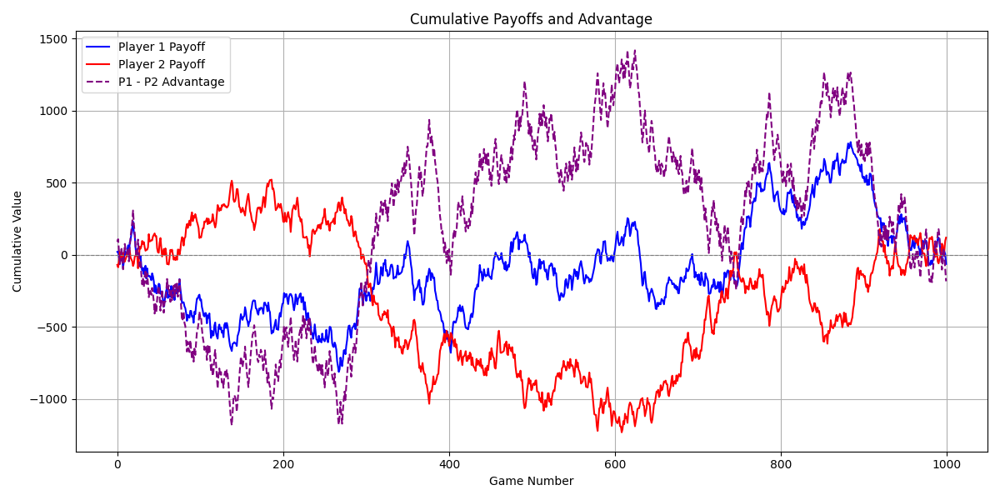
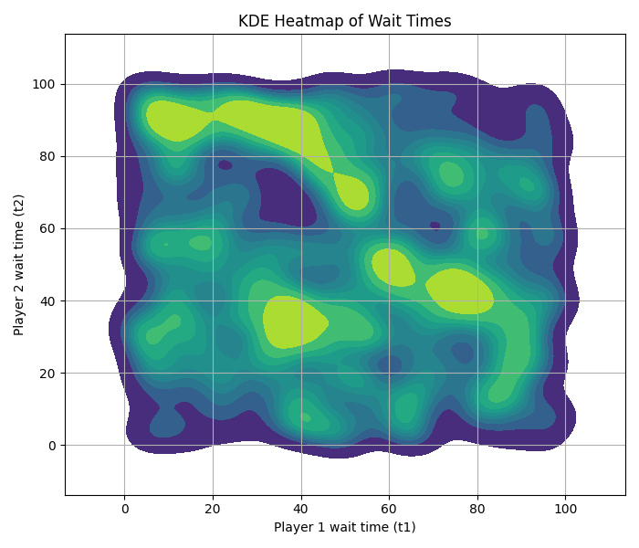

# 🕰️ War of Attrition – Simulation & Visualization
This project simulates the classic game War of Attrition in Python and provides various visualizations to analyze the players’ strategies and outcomes under randomized decision-making.

--- 

## Game Rules
Each of two players selects a waiting time t (from 0 to 100). The player who is willing to wait longer wins a reward but pays the cost of waiting.

- If t1 < t2:
  
  Player 1 payoff: -t1
  
  Player 2 payoff: v - t2

- If t1 > t2:
  
  Player 1 payoff: v - t1
  
  Player 2 payoff: -t2

- If t1 == t2:
  
  Both players receive: v / 2 - t


Where v = 100 is the fixed value of the reward.

---

## Visualizations

The simulation runs multiple games (e.g., 1000) and generates the following visualizations:

- **Payoff Difference Histogram**  
  Displays the distribution of differences between Player 1 and Player 2's payoffs across games.

- **Scatter Plot of Payoffs**  
  Shows each game's result as a point in a 2D plot: Player 1's payoff vs. Player 2's.

- **Cumulative Payoffs and Advantage**  
  Tracks the total payoff for each player over time, along with their difference (Player 1 - Player 2).

- **KDE Heatmap of Wait Times**  
  A 2D density map showing how often players choose specific combinations of wait times.

---

## Example Visualizations

### Scatter Plot of Payoffs


### Payoff Difference Histogram


### Cumulative Payoffs and Advantage


### KDE Heatmap of Wait Times


---

## How to Run

1. Install required libraries (matplotlib and seaborn):

  ```
  pip install matplotlib seaborn
  ```

2. Clone this repository:

  ```
  git clone https://github.com/Cay00/war-of-attrition-sumulation.git
  cd monty-hall-simulation
  ```

3. Run the program:
 
  ```
  python WarOfAttrition/war_of_attrition.py
  ```

The terminal will show total payoffs, and the program will display each plot one by one.

---

## Project Files

- war_of_attrition.py: The simulation and plotting code.

- images/: Directory to store generated plots (optional).

- README.md: Description and usage instructions.
